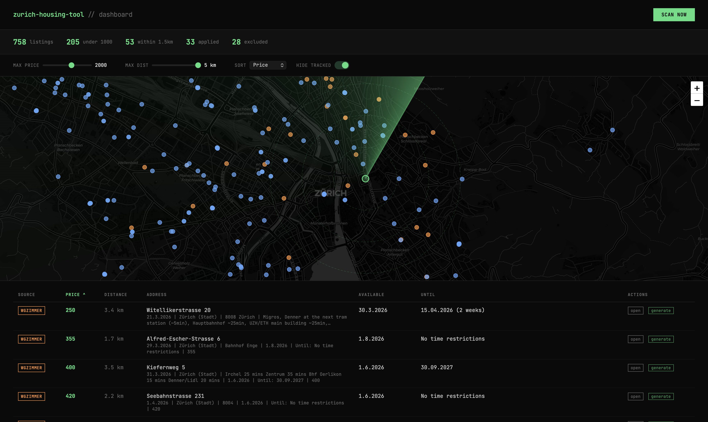

# zurich-housing-tool



Finding housing in Zurich sucks. You already know this. You're competing with hundreds of people for every halfway decent WG room, most of the affordable listings are age-restricted student housing you don't qualify for, and half the online listings are corporate spam with fake addresses. It's a numbers game. You send 30+ applications to get 2-3 viewings to maybe get 1 offer.

This tool automates the grind. It scrapes the major Swiss housing platforms, filters out the garbage, tracks your applications, and lets you blast out messages without losing your mind.

## What it does

- **LLM-powered application messages**: Uses a local LLM (via [Ollama](https://ollama.com)) to auto-generate tailored application messages for each listing based on your profile. Fill in your details once, hit generate, and get a personalized message that actually reads the listing description. Bilingual (German + English) when needed.
- **Scrapes 3 platforms**: [wgzimmer.ch](https://wgzimmer.ch) (reCAPTCHA v3 bypass via [CloakBrowser](https://github.com/CloakHQ/CloakBrowser)), [flatfox.ch](https://flatfox.ch) (public pin API), and [ronorp.net](https://ronorp.net)
- **Smart filters**: Optionally hide WOKO/JUWO (age-restricted student housing), gender-restricted listings, short sublets (<2 months), and corporate spam (A/NTERIM, NextGen Properties, fake-address listings). All configurable.
- **Geocodes addresses** for real walking distance from your target (ETH Zentrum, UZH, wherever)
- **Tracks applications** so you don't accidentally apply to the same place twice
- **Web dashboard** with a radar map, sortable listings table, and application tracker
- **Desktop notifications** when new listings appear (macOS)

## Setup

```bash
git clone https://github.com/joshuaswanson/zurich-housing-tool.git
cd zurich-housing-tool
./setup.sh
```

That's it. The setup script installs dependencies, creates your config files, pulls the LLM model (if Ollama is installed), and runs an initial scan. Then:

```bash
node server.js
```

Open http://localhost:3456 and start hunting.

**Optional**: Install [Ollama](https://ollama.com) for LLM-powered message generation. The tool works without it, but you won't get auto-generated application messages.

Edit `config.json` to set your target location:

```json
{
  "target": {
    "lat": 47.3764,
    "lng": 8.5483,
    "label": "ETH Zentrum"
  },
  "search": {
    "maxPrice": 2000,
    "region": "zurich-stadt",
    "minDuration": 60
  },
  "exclude": {
    "woko": true,
    "genderRestricted": true,
    "shortSublets": true,
    "overAge": 28,
    "spam": ["A/NTERIM", "NextGen Properties"]
  }
}
```

**Common target locations:**
| Location | Lat | Lng |
|----------|-----|-----|
| ETH Zentrum | 47.3764 | 8.5483 |
| ETH Honggerberg | 47.4085 | 8.5075 |
| UZH Zentrum | 47.3744 | 8.5508 |
| UZH Irchel | 47.3975 | 8.5495 |

## Commands

### Scan for listings

```bash
node monitor.js scan                 # Scan all sources
node monitor.js scan --fresh         # Force fresh scrape (ignore cache)
node monitor.js scan --radius 2      # Only show within 2 km
node monitor.js watch 15             # Auto-poll every 15 min + desktop notifications
```

### Search & filter

```bash
node search.js                                    # Everything from cache
node search.js --max-dist 1.5                     # Within 1.5 km of target
node search.js --max-price 1500                   # Price cap
node search.js --not-tracked                      # Hide applied/excluded
node search.js --sort distance                    # Sort by distance (default: price)
node search.js --keyword "Seefeld|Kreis 8"        # Regex filter on description
node search.js --new                              # Last 24 hours only
node search.js --new 48                           # Last 48 hours
node search.js --permanent                        # Unlimited duration only
node search.js --include-gendered                 # Include female-only WGs
node search.js --include-short                    # Include sublets < 2 months
node search.js --fetch 5                          # Auto-fetch details for top 5

# The kitchen sink:
node search.js --max-dist 2 --not-tracked --sort distance --new --fetch 3
```

### Fetch full listing details

```bash
node fetch-listing.mjs <url>                      # Fetch and cache one listing
node fetch-listing.mjs <url1> <url2> ...          # Multiple
node fetch-listing.mjs --from-file urls.txt       # From file
node fetch-listing.mjs --summary <url>            # Compact summary from cache
node fetch-listing.mjs --summary --all            # All cached listings
```

Fetched listings are auto-checked for WOKO/JUWO/spam and excluded from future searches.

### Track applications

```bash
node track.js                           # List all tracked
node track.js status                    # Dashboard with stats
node track.js apply <url> [address]     # Mark as applied
node track.js shortlist <url>           # Shortlist
node track.js exclude <url> <reason>    # Not interested
node track.js reject <url>              # They rejected you
node track.js note <url> <text>         # Add a note
node track.js check <url>              # Check if tracked
node track.js backfill                  # Populate price/address from cache
```

### Web dashboard

```bash
node server.js                          # Start dashboard at http://localhost:3456
npm run dashboard                       # Same thing
```

Dark-mode dashboard with a radar map of Zurich, sortable/filterable listings table, and application tracker. The "Scan Now" button triggers a full scrape and batch-fetches listing details for geocoding.

### Useful links

```bash
node monitor.js links                   # Housing search URLs for Zurich
```

## How it works

**flatfox.ch** has a public pin API (`/api/v1/pin/`) that returns listing coordinates and prices. No auth needed. We calculate haversine distance from your target and cache pins locally.

**wgzimmer.ch** uses Google reCAPTCHA v3 which blocks every headless browser (Playwright, Puppeteer, Firefox, WebKit, puppeteer-extra-stealth). We use [CloakBrowser](https://github.com/CloakHQ/CloakBrowser), a custom Chromium with source-level anti-detection patches that passes reCAPTCHA v3 fully headless.

**ronorp.net** is a smaller Zurich classifieds site. Lower volume but different audience.

**Geocoding** uses Nominatim (OpenStreetMap). Addresses are geocoded on fetch and cached permanently so distance calculations are instant.

**Spam detection** catches corporate housing companies that list fake addresses in the city center but are actually in Ruschlikon, Wollishofen, etc.

## File structure

```
monitor.js            Scan all sources, watch mode, desktop notifications
search.js             Search & filter cached listings
fetch-listing.mjs     Fetch full listing details (wgzimmer + flatfox)
track.js              Application tracker + dashboard
wgzimmer-scrape.mjs   CloakBrowser wgzimmer scraper
ronorp-scrape.mjs     CloakBrowser ronorp scraper
lib.js                Shared utilities (config, distance, geocoding, cache)
config.json           Your config (gitignored)
config.example.json   Config template
tracker.json          Your application data (gitignored)
data/                 All cached data (gitignored)
```

## Support

If you find this useful, [buy me a coffee](https://buymeacoffee.com/swanson).


## License

MIT
